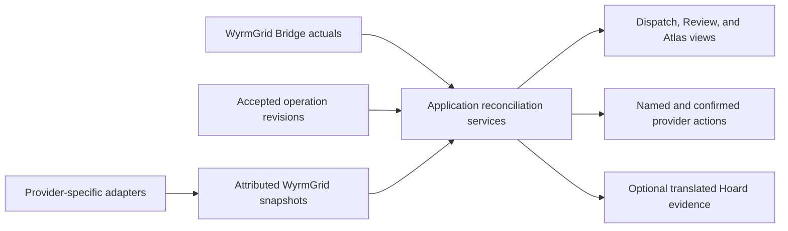

# High-value provider integration process

Status: planning only. No provider adapter or external action described here is
implemented or certified unless its authoritative provider document says so.

This programme turns the integration candidates assessed at 7/10 or higher on
2026-07-19 into an evidence-gated delivery sequence. The scores express current
WyrmGrid priority, not provider quality, contractual commitment, or guaranteed
feasibility. BeyondATC is deliberately excluded until a partnership or supported
companion contract establishes what integration is permitted.

Provider-specific contracts remain authoritative in the
[SayIntentions plan](sayintentions.md),
[online-network plan](online-networks.md), and
[navigation and interchange plan](navigation-and-interchange.md). This document
owns the cross-provider sequence, shared application boundaries, and feature
acceptance gates.

## Selected candidates

| Candidate                                                  |  Score | Initial delivery position                         |
| ---------------------------------------------------------- | -----: | ------------------------------------------------- |
| SayIntentions opt-in connection and health                 |  10/10 | First read-only slice                             |
| SayIntentions active-operation correlation                 |  10/10 | First read-only slice                             |
| SayIntentions runway, gate, frequency, and airport context | 9.5/10 | Read-only after the local session contract        |
| Direct VATSIM public adapter                               | 9.5/10 | First online-network slice                        |
| SayIntentions planned-versus-assigned findings             |   9/10 | After operation correlation                       |
| SayIntentions ATC and traffic coexistence guard            |   9/10 | Before any SayIntentions action                   |
| SayIntentions user-previewed ACARS dispatch                |   9/10 | First external-action slice                       |
| Navigraph Navigation Data                                  |   9/10 | Apply early; implement only after approval        |
| SayIntentions lifecycle-triggered crew announcements       | 8.5/10 | Later default-off automation                      |
| Direct IVAO public adapter                                 | 8.5/10 | Second online-network slice                       |
| SayIntentions structured Hoard debrief context             |   8/10 | Session-only first; persistence requires review   |
| SayIntentions confirmed gate assignment                    |   8/10 | Explicit external action after read-only gate use |
| SayIntentions minimized VA-Link context                    | 7.5/10 | Separate partnership and governance project       |
| SayIntentions deliberate operational-adviser voice action  |   7/10 | User-initiated action after message controls      |

Candidates below 7/10 are not promoted by this programme. A later reassessment
may change a score only after the public contract, partnership, demonstrated
user need, or WyrmGrid architecture materially changes.

## Shared architecture

The architecture follows
[ADR-0008](../architecture/decisions/0008-provider-adapters-and-operational-snapshots.md):

- raw provider payloads, endpoint construction, and provider enums remain in a
  cohesive Rust adapter;
- application-owned snapshots carry provider, observation time, retrieval time,
  transformation version, freshness, and relevant provider revision;
- WyrmGrid Bridge remains the source of simulator actuals and confirmed
  lifecycle evidence;
- reconciliation produces matches, differences, stale evidence, unavailable
  evidence, and recommendations without rewriting source observations;
- Tauri commands expose narrow application operations, never a generic provider
  proxy, and Svelte only presents state and delegates actions;
- read access, external writes, simulator mutation, transcript retention, and
  plugin sharing are separate capabilities; and
- every optional provider degrades independently and may be disabled without
  preventing WyrmGrid startup or offline use.

Shared types should appear only when the first implemented use requires them.
The expected concepts are an attributed ATC-service session, provider frequency
and airport assignments, distinct online-network activity snapshots, navigation
dataset identity, and host-owned reconciliation findings. This plan does not
advance an application schema, plugin protocol, Bridge protocol, migration, or
stored-snapshot version.

## Common delivery gates

Every provider or external action passes the following gates in order.

1. **Contract and permission** — recheck the official contract, terms,
   availability, authentication, pricing or entitlement, rate guidance, data
   retention, redistribution limits, and write semantics. Record the check date.
2. **Threat and privacy scope** — enumerate credentials, identity, location,
   route, free-form text, licensed data, and external side effects. Update the
   threat model before implementation when the boundary changes.
3. **Private raw adapter** — implement bounded retrieval and parsing without
   allowing raw data, request URLs, redirect targets, or secret-bearing failures
   to cross the adapter boundary.
4. **Stable translation** — allowlist only fields required by the first feature,
   attach provenance and freshness, and discard unnecessary personal data before
   the application or interface sees the result.
5. **Unavailable-data behaviour** — define disabled, unauthorised, inactive,
   offline, stale, malformed, unsupported, and entitlement-lost states before
   designing the successful presentation.
6. **Application service** — put correlation, scheduling, caching, conflict
   detection, authorization, and action policy in Rust application services.
7. **Presentational surface** — show provider, observation time, disagreement,
   and degraded state. Interface handlers do not calculate readiness or perform
   provider writes directly.
8. **Persistence decision** — begin session-only. Add Hoard persistence only
   when a stable historical use, retention rule, deletion behaviour, encryption
   boundary, schema decision, and lowest-layer tests have been approved.
9. **Deterministic validation** — add sanitized fixtures, boundary and failure
   tests, secret and personal-data canaries, polling or action-policy tests, and
   compatibility coverage before live certification.
10. **Outside-repository certification** — test authenticated or live behaviour
    with maintainer-controlled accounts outside the repository. Commit only
    sanitized mappings and results; never commit a key or raw personal payload.

Passing an earlier gate does not authorize a later one. In particular, a public
read feed does not authorize identity matching, account authentication, a write,
long-term retention, or plugin access.

## SayIntentions read-only foundation

### SI-1: transport and session health

The first spike compares the two documented local access methods: the fixed
loopback HTTP endpoint and the generated `flight.json` file. Both return the
same credential-bearing active-flight payload. The spike must:

- require explicit feature consent before the first read;
- use only the documented Windows location or a fixed loopback address;
- never accept a LAN address, provider hostname, path, or redirect discovered in
  the payload;
- compare absence, inactive flight, empty response, partial file rewrite,
  malformed JSON, oversized content, schema change, and process shutdown;
- poll or debounce no faster than the documented update behaviour requires; and
- choose the released transport only after reviewing filesystem permission,
  local-server exposure, cancellation, startup ordering, and supportability.

The adapter immediately treats the discovered account key as a secret. It
discards email, account identifiers, logging configuration, multiplayer group
codes, endpoints, and every other field outside the initial allowlist. The
application receives a small connection view such as disabled, unavailable,
inactive, ready, stale, malformed, or unsupported. It never receives the raw
payload or key.

Initial acceptance requires synthetic fixtures for both transports, bounded
failure codes, and canary tests proving that secrets, personal values, paths,
routes, coordinates, and raw parse failures cannot reach logs, Sentry, SQLite,
plugins, Tauri payloads, or Svelte state.

### SI-2: active-operation correlation

After a safe session exists, translate only the verified fields needed to
identify the SayIntentions flight: an opaque session reference, callsign,
origin, destination, provider update time, and available provider plan identity.
The application compares them with the accepted
[flight-operation revision](../operations/flight-operation-lifecycle.md) and the
current SimBrief snapshot.

Correlation is deterministic and explainable:

- exact normalized origin and destination agreement is a match;
- a different available value is a difference, never an automatic replacement;
- missing or stale provider values remain unavailable or stale;
- callsign agreement may strengthen a match but does not override a route
  conflict; and
- an ambiguous candidate requires the user to select or confirm the association.

The association points to an immutable operation revision. If the operation or
SayIntentions session changes, dependent context and findings are invalidated and
recomputed rather than silently carried forward.

### SI-3: assigned airport and frequency context

Once SI-2 is reliable, add provider-labelled current frequencies, current
airport, parking or gate assignment, and assigned departure or arrival runway
only where sanitized fixtures prove the current contract. Each value retains its
own observation time and source.

Dispatch and Review show planned and provider-assigned values side by side.
Atlas may show the provider gate or runway context only when it has validated
coordinates or a safe host-owned airport reference. WyrmGrid never presents a
SayIntentions assignment as a simulator actual, real-world ATC clearance, OnAir
mutation, or proof that the scenery contains the assigned stand.

Findings use the normal operation-review vocabulary:

- **match** when planned and assigned values agree;
- **difference** when both exist and disagree;
- **stale** when the SayIntentions observation exceeds its freshness policy; and
- **unavailable** when the provider does not supply a usable value.

No finding changes the accepted operation automatically. The user may revise the
plan or acknowledge a tactical difference through the existing operation
revision service.

### SI-4: ATC and traffic coexistence guard

Before WyrmGrid exposes any SayIntentions action, add a host-owned preference for
the user's current ATC environment and traffic injector. Initial values may
include SayIntentions, VATSIM, IVAO, another provider, simulator-native, or none.
The selection is a user preference, not proof that the service is connected.

The application may combine that preference with safely observed provider state
to warn about likely simultaneous ATC services or multiple traffic injectors.
It does not automatically disable ATC, change a simulator variable, tune a radio,
or terminate another application. Any later one-shot remediation is a separately
reviewed and confirmed action.

The guard must also prevent network overlays from implying that the user is
connected to VATSIM or IVAO. Correlation with a public network callsign begins
only after the user explicitly supplies or confirms that callsign.

## SayIntentions external actions

All SayIntentions actions are named application commands with independent
authorization and availability checks. There is no endpoint selector, arbitrary
parameter form, generic SAPI client, or plugin-accessible provider proxy.

### SI-5: previewed ACARS dispatch

The first write slice sends one user-previewed inbound ACARS, CPDLC, or telex
message to the associated active flight. The flow is:

1. select one host-owned template and one accepted operation revision;
2. populate only approved fields from attributed WyrmGrid snapshots;
3. normalize whitespace and reject unresolved placeholders, untrusted inserted
   text, disallowed content, and content over the provider's 128-character ACARS
   limit;
4. show channel, sender identifier, message type, exact final text, provider,
   and whether an active provider session is required;
5. obtain momentary confirmation in the application service;
6. perform one bounded request through the pinned provider origin; and
7. record only a sanitized result code, template identifier, operation revision,
   and time if local audit is approved.

An ambiguous timeout is `outcome_unknown`, not a failure that may be retried.
The user can inspect the result but must deliberately create a new send. Initial
templates should cover a small operational set such as revised dispatch,
material delay, diversion, maintenance attention, job deadline, or arrival
coordination. Templates must not present a recommendation as ATC instruction.

### SI-6: lifecycle-triggered crew announcements

Crew announcements use WyrmGrid Bridge lifecycle evidence, not the provider's
best-effort flight phase. Implement them only after manual SI-5 messages and
their action controls are proven.

Each automation is a named, default-off rule with:

- an explicit Bridge event and minimum evidence policy;
- one approved intercom target and host-owned aviation-themed template;
- per-event duplicate suppression across reconnects and lifecycle jitter;
- a cooldown and hard per-flight generation budget below current provider
  guidance;
- a visible remaining budget and immediate disable control; and
- no automatic retry after an unknown outcome.

Initial rules should be limited to confirmed phases such as departure, cruise,
descent, and arrival. The application must remain useful when the crew entity is
unavailable, the selected intercom mapping changes, or the provider declines a
message.

### SI-7: deliberate operational-adviser voice

This is a manual transformation of one selected WyrmGrid finding into a short
crew, copilot, or dispatcher-style advisory. The user chooses the finding,
target, and exact preview before sending. Only the finding's attributed facts and
an approved explanatory template are eligible; arbitrary plugin text, provider
transcripts, and model-generated wording are excluded initially.

The message states uncertainty explicitly. A weather concern, deadline risk, or
plan mismatch remains a WyrmGrid recommendation or observation and must not be
voiced on an ATC channel as though it were a clearance.

### SI-8: confirmed gate assignment

Gate assignment is a distinct external write. WyrmGrid first reads the current
provider gate, then lets the user select a candidate for the active operation.
The service validates the airport identifier, gate syntax, active session,
operation association, and current provider assignment before showing a final
confirmation.

One request produces one of: assigned, rejected, unavailable, invalid, or
outcome unknown. There is no ambiguous automatic retry. A successful response
creates a new SayIntentions assignment observation; it does not modify OnAir,
SimBrief, scenery, or the accepted WyrmGrid operation. Any plan revision remains
a separate user decision.

### SI-9: minimized VA-Link context

VA-Link is not an extension of ordinary pilot-key support. Begin only after
SayIntentions accepts the relevant airline or WyrmGrid use case and supplies a
separate least-privileged virtual-airline key.

Before implementation, agree with the provider and maintainer on:

- which WyrmGrid or OnAir company is represented and who may administer it;
- ownership, update frequency, replacement semantics, retention, withdrawal,
  and deletion or clearing behaviour;
- whether WyrmGrid is permitted to send per-flight rather than long-lived
  context;
- how users preview, consent to, inspect, refresh, and stop sharing; and
- branding, attribution, support, and account-removal behaviour.

Define separate allowlists for crew, dispatcher, copilot, and SkyOps context.
Prefer aggregate passenger and freight values, operation identifiers, route
summary, aircraft summary, sourced constraints, and company style. Exclude names,
contact details, staff records, manifests, raw OnAir fields, credentials,
transcripts, precise history, and unrelated company data unless a later reviewed
requirement proves they are necessary and permitted.

Every submission is previewed, versioned locally by a content hash or revision,
and tied to the provider account and operation scope without storing the
provider's raw response. WyrmGrid does not enable VA-Link until it can explain
what remains stored by the provider and how the user or administrator can stop
future use.

## SayIntentions and Hoard

Begin with session-only SayIntentions observations. The first useful debrief can
join them in memory with an associated Bridge recording and accepted operation
revision. It must continue to show three separate streams:

1. **planned** — accepted WyrmGrid and SimBrief evidence;
2. **assigned** — SayIntentions runway, gate, frequency category, or clearance
   flags where verified; and
3. **actual** — Bridge lifecycle and simulator telemetry.

Persistent Hoard support requires a separate storage and threat-model review.
The proposed stored record is a bounded translated event or snapshot containing
provider, observation time, transformation version, event kind, sanitized value,
operation revision, and recording association. It excludes the account key, raw
active-flight payload, complete route, coordinates not already justified by the
recording, communication text, audio URLs, identity fields, and multiplayer
configuration.

The storage design must define retention, deletion with or independently of the
recording, portable-backup behaviour, export redaction, unsupported-version
handling, and whether an append-only migration is required. Until those
decisions and lowest-layer tests exist, the debrief remains session-only and may
honestly report that provider history is unavailable.

## Direct VATSIM process

The initial VATSIM integration uses the official unauthenticated Data API and
Events API directly. It does not require VATSIM Connect, use SayIntentions as a
proxy, or identify the WyrmGrid user.

1. Implement a private Rust client with a fixed HTTPS origin, response-size and
   record-count ceilings, timeout, cancellation, stale-data, and backoff policy.
2. Poll no more frequently than every 30 seconds and only while a VATSIM layer or
   relevant route context is visible. Honour the provider's 15-second feed
   generation floor rather than treating it as a target poll rate.
3. Discard names, member IDs, ratings, server addresses, remarks, and unused
   free-form fields during translation.
4. Translate only the required pilot position, aircraft category, callsign,
   controller position, frequency, ATIS identifier, relevant airport references,
   and provider timestamps into a VATSIM-labelled snapshot.
5. Fetch events on a separate schedule appropriate to event times and retain
   only the fields required for opt-in planning hints.
6. Render bounded Atlas clusters, controller and ATIS context, and route-airport
   coverage with visible provider time and stale state.
7. Match the user's callsign only after explicit confirmation; do not infer
   identity from the simulator, OnAir, SimBrief, or SayIntentions alone.

The first slice is read-only and session-cached. OAuth, filing, network audio,
member profiles, ratings, and persistent global activity remain separate future
projects. Fixtures must cover personal-field removal, schema changes, malformed
coordinates, antimeridian positions, free-form text, record storms, staleness,
and visibility-based polling suspension.

## Direct IVAO process

IVAO follows the same product sequence but retains a distinct raw adapter,
provider model, and presentation source. It is not a VATSIM schema variant.

1. Reconfirm the official Whazzup access and polling rules immediately before
   implementation.
2. Fetch gzip-compressed data with independent compressed and decompressed size
   ceilings, streaming or bounded decompression, timeouts, and cancellation.
3. Poll no more frequently than every 30 seconds while the IVAO layer or route
   context is visible.
4. Discard personal identifiers and unused free-form content before translation.
5. Preserve IVAO-specific facility, status, aircraft, and flight semantics where
   they do not genuinely match the provider-neutral view.
6. Render a visibly IVAO-labelled Atlas layer and airport coverage context; never
   merge it into an invented combined online network.
7. Require explicit user callsign confirmation before personal correlation.

Private Data API operations, Login/OAuth, user records, flight-plan writes, API
keys, and long-term global activity storage are excluded from the first slice.
Validation adds compressed-input truncation, decompression bomb, unknown enum,
poll-limit, and provider-switching cases to the shared online-network matrix.

## Navigraph Navigation Data process

Navigraph begins as an approval track rather than an implementation assumption.
The maintainer first prepares an application request that describes WyrmGrid as
an external desktop flight-simulation application, the requested Navigation Data
use, authentication flow, redirect or device flow, local caching proposal,
entitlement handling, route resolution, and any intended Atlas presentation.

The request explicitly excludes embedded Charts API use unless Navigraph offers
and approves a compatible design. It also asks whether the proposed route and
procedure presentation is permitted and not considered a prohibited chart-like
rendering. WyrmGrid does not build around an unapproved client secret or assume
that public documentation constitutes application approval.

After written approval:

1. implement the provider-approved native authorization flow, preferably a
   PKCE-based flow suitable for desktop use;
2. keep refresh tokens in the operating-system credential store and access
   tokens in memory; never embed a shared secret in the desktop binary;
3. retrieve only approved package metadata and record package identifier, AIRAC,
   revision, package status, entitlement class, retrieval time, and hash without
   exposing signed download URLs;
4. enforce download, compressed, expanded, file-count, path, and parsing limits,
   then verify every documented hash before use;
5. keep licensed raw packages and indexes inside the first-party provider
   boundary and outside plugins, diagnostics, Sentry, support bundles, exports,
   and unentitled accounts;
6. resolve route identifiers against the declared dataset without deleting
   ambiguous, unresolved, discontinuous, or provider-specific legs;
7. return attributed resolution results to the canonical route service and show
   AIRAC agreement, mismatch, ambiguity, and unavailable entitlement; and
8. implement the provider-approved offline, update, logout, subscription-expiry,
   token-revocation, and package-deletion policy before durable caching.

The first user value should be AIRAC-aware route validation and identifier
resolution, not an imitation chart. Any geometry presented in Atlas must be
within the approved purpose, visibly sourced, and unavailable to community
plugins or unrestricted export.

Required tests cover authorization state and redirect validation, token
redaction, entitlement changes, outdated and future package status, hash
mismatch, signed-URL leakage, archive traversal and expansion, unknown data
revision, identifier collision, AIRAC mismatch, offline cache policy, logout,
and plugin or export isolation.

## Recommended delivery order

Some provider contact can proceed in parallel, but implementation follows these
dependencies:

1. **Planning and approval** — keep official contract notes current, apply to
   Navigraph, open any required SayIntentions or VA-Link conversation, and draft
   the threat-model changes without claiming approval.
2. **SayIntentions read foundation** — SI-1 through SI-3, session-only and without
   external writes or Hoard persistence.
3. **Direct VATSIM** — prove the online-network snapshot and Atlas density model
   with the better-documented public feed.
4. **Provider coexistence** — deliver SI-4 before actions or a second live
   network source.
5. **Direct IVAO** — reuse only proven host abstractions while retaining an
   independent adapter and semantics.
6. **SayIntentions manual actions** — SI-5, SI-7, and SI-8, each with separate
   confirmation, action policy, and regression tests.
7. **SayIntentions automation** — SI-6 only after Bridge lifecycle evidence and
   manual message budgets are stable.
8. **Historical context** — add translated SayIntentions Hoard evidence only
   after the persistence, retention, and deletion review.
9. **Navigraph implementation** — begin when the provider approves the exact
   desktop design; do not block unrelated public-feed work while waiting.
10. **VA-Link** — SI-9 remains last because it adds a second credential,
    persistent provider-side context, administrator authority, and partnership
    obligations.

Each slice should ship useful unavailable-data behaviour. A user without
SayIntentions, a network account, a Navigraph entitlement, an active simulator,
or internet access must still be able to use the rest of WyrmGrid honestly.

## Release and support evidence

Before enabling a provider feature in a public build:

- recheck official documentation and terms at the release date;
- record the implemented field allowlist and rejected fields;
- retain only synthetic fixtures in the repository;
- pass formatting, Clippy with warnings denied, Rust tests, frontend type and
  build checks, applicable audits, and provider-specific canary tests;
- perform an outside-repository live or authenticated test when required;
- update the threat model for credentials, external writes, licensed data,
  identity correlation, or persistence;
- document degraded, offline, revoke, forget, retention, and deletion behaviour;
  and
- describe compatibility as certified only for the exact provider contract,
  platform, and observation tested.

A provider's documentation, a successful synthetic fixture, or another product's
native integration is not evidence that WyrmGrid works live. Preview endpoints,
terms, prices, schemas, entitlement rules, and rate guidance remain release-time
verification gates.

## References

- [SayIntentions SAPI, local flight data, and SimAPI](https://p2.sayintentions.ai/p2/docs/)
- [SayIntentions SayAs API](https://kb.sayintentions.ai/article/sayas-api)
- [SayIntentions VA-Link](https://kb.sayintentions.ai/article/va-link-virtual-airline-integration-api)
- [VATSIM API overview](https://vatsim.dev/services/apis/)
- [VATSIM live network feed](https://vatsim.dev/api/data-api/get-network-data/)
- [VATSIM Events API](https://vatsim.dev/api/events-api/list-all-events/)
- [IVAO API documentation](https://api.ivao.aero/docs)
- [IVAO API and Whazzup rules](https://wiki.ivao.aero/en/home/ivao/regulations)
- [IVAO Whazzup v2 retrieval](https://wiki.ivao.aero/en/home/devops/api/whazuup/how-to-retrieve-v2)
- [Navigraph developer access](https://developers.navigraph.com/docs/request-access)
- [Navigraph restrictions](https://developers.navigraph.com/docs/general/restrictions)
- [Navigraph authentication](https://developers.navigraph.com/docs/authentication/overview)
- [Navigraph Navigation Data API](https://developers.navigraph.com/docs/navigation-data/api-overview)
