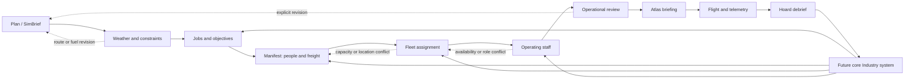

# Flight operation lifecycle

Status: staged implementation; schema-1 persistent operation identity,
append-only revisions, job-derived aggregate manifest, and journey summary
implemented.

This document defines the long-term WyrmGrid journey from an attributed flight
plan to a recorded and reviewed operation. It joins plan, weather, OnAir work,
the complete manifest, fleet, staff, Atlas, simulator telemetry, and Hoard
without allowing any interface workspace to become the owner of operational
truth.

The journey is deliberately broader than a wizard. A user may move between
stages whenever useful, while WyrmGrid preserves dependencies, provenance,
staleness, and unresolved conflicts.

## Core ownership

The Rust domain and application layers now own versioned
`FlightOperationRevision`, `FlightManifest`, and `FlightOperationJourneyView`
schema-1 contracts. Append-only database migration 13 stores immutable revision
snapshots under a stable operation identity and points to one active operation.
These domain schemas, database migration number, Bridge protocol, and plugin
protocol are independent compatibility markers.

The implemented manifest is deliberately narrow: it deterministically copies
per-leg aggregate passenger counts and freight weights from the explicitly
selected validated OnAir job. Missing source fields are retained as unavailable.
It does not yet represent individual people, roles, baggage, or consignments.
The domain rejects a stored manifest that differs from its retained job
evidence.

A flight operation references attributed source snapshots and explicit user
selections. It should contain, when available:

- the selected plan and all revisions accepted for this operation;
- weather observations, forecasts, retrieval times, and acknowledged gaps;
- candidate and selected OnAir jobs or user-defined objectives;
- a per-leg manifest of transported people and freight;
- candidate and selected aircraft, including the observed location and
  availability used for the decision;
- operating-staff assignments and any sourced qualification or availability
  facts;
- reconciliation findings, user acknowledgements, and unresolved blockers;
- Atlas briefing state;
- the associated simulator recording; and
- the resulting Hoard debrief and planned-versus-observed comparisons.

Credentials, private provider responses, executable plugin state, and invented
facts do not belong in this aggregate. Raw provider data remains inside its
adapter. The operation uses stable WyrmGrid domain models with provenance.

## Lifecycle stages

### 1. Plan

Import or select a simulator-neutral, provenance-aware plan. SimBrief is the
first provider, not the definition of a plan. Missing route geometry, schedule,
AIRAC, aircraft, fuel, or alternate data remains unavailable rather than being
filled with plausible values.

### 2. Weather and constraints

Attach current or historical weather evidence relevant to the plan. Weather
may explain a need to reconsider routing, fuel, alternates, timing, or aircraft,
but WyrmGrid must not silently mutate the plan or present an unqualified safety
decision. Any revision creates an explicit new operation revision.

### 3. Jobs and objectives

Jobs describe contractual or player-selected intent: what outcome is desired,
where it begins and ends, applicable time windows, and any observed commercial
terms. A job is not the physical load itself. WyrmGrid remains read-only toward
OnAir and does not accept, dispatch, complete, purchase, or otherwise mutate an
OnAir operation unless a future, separately reviewed official contract permits
that exact action.

### 4. Manifest

The manifest describes everything and everyone transported on each flight leg.
Its user-facing sections are **Passengers** and **Freight**; neither is hidden
inside a single undifferentiated payload number.

Passenger categories may include:

- tourists or other commercial passengers;
- clients, contractors, workers, or job-related travellers;
- company personnel travelling without operating that leg;
- positioning or deadheading staff; and
- the user or the user's OnAir avatar, when an attributed source or explicit
  user selection can identify that presence.

Freight may include general cargo, mail, specialist consignments, baggage,
industrial inputs, industrial outputs, and other sourced load categories.
WyrmGrid should retain individual consignments when the provider exposes them;
an aggregate mass must not be presented as item-level evidence.

Each person receives exactly one transport role per leg. A staff member may be
operating crew on one leg and a positioning passenger on another, but must not
be counted as both on the same leg. The same rule applies to the player avatar:
pilot, other operating crew, company traveller, or passenger are distinct
roles. Occupied seats, payload mass, and role counts derive from this canonical
assignment rather than parallel interface totals.

Unknown passenger mass, baggage, cargo volume, handling needs, or location
remain explicit unknowns. Defaults may exist only as named, user-reviewable
assumptions and must never masquerade as OnAir facts.

### 5. Fleet assignment

Compare the manifest and route with available aircraft evidence: seats, payload
and cargo capacity, range, fuel, configuration, current location, condition,
maintenance state, airport suitability, and availability. Only fields proven
by the current provider contract may be treated as OnAir facts. Missing or stale
evidence produces an unavailable or needs-attention result, not an inferred
pass.

Changing the aircraft invalidates dependent calculations. It does not silently
rewrite the plan, manifest, staff assignment, or fuel assumptions.

### 6. Operating staff

Staff describes people assigned to operate or support the flight rather than
everyone transported by it. Potential roles include flight deck, cabin, and
other operation-specific assignments when the source model supports them.

WyrmGrid may compare observed location, availability, assignment, and sourced
qualifications. It must not invent qualifications, duty legality, employment
status, or regulatory compliance. Duty-time or legal-readiness calculations
require a separately documented source and ruleset before they can become more
than labelled planning assistance.

OnAir staff capabilities and fields must be reverified against the live public
contract and sanitized authenticated fixtures before implementation. This
future stage is not evidence that every desired staff fact is currently
available.

### 7. Operational review

The review is the explainable reconciliation point, not a hidden score. It
should separate at least:

- **matches** — sourced evidence agrees;
- **differences** — two available sources disagree;
- **constraints** — a selected combination exceeds a known boundary;
- **stale evidence** — a previously available fact is too old for its policy;
- **unavailable evidence** — a required fact was not supplied; and
- **user assumptions** — an explicit value selected in place of unavailable
  evidence.

Examples include aircraft or staff at another airport, insufficient seats or
payload capacity, a registration mismatch, cargo not located at the origin,
weather affecting an alternate or fuel assumption, a deadline conflict, and a
person assigned incompatible roles on the same leg.

Readiness means that WyrmGrid has completed its declared checks with the
available evidence. It is not an airworthiness release, legal dispatch,
regulatory approval, or guarantee of a safe or profitable flight.

### 8. Atlas briefing

Atlas presents the accepted operation revision: sourced route geometry,
weather, job and manifest context, aircraft and staff locations where permitted,
and clearly labelled gaps. It does not become a second parser or resolver of
the operation. Selecting a feature returns a stable host-issued identifier to
the application layer.

### 9. Flight and telemetry

WyrmGrid Bridge may associate the accepted operation revision with a simulator
recording. Plan, assignments, and recorded facts remain separate evidence.
Starting telemetry never claims that an OnAir action has occurred.

### 10. Hoard debrief

Hoard links the immutable preparation evidence to bounded, gap-preserving
recorded facts. It can compare plan, weather, manifest assumptions, fuel,
duration, route progress, and other supported observations without rewriting
the historical operation. Later analysis may feed future planning or Industry
decisions as attributed calculations, never retroactive facts.

## Navigation and stage state

The interface should expose a persistent journey rail such as:

`Plan -> Weather -> Jobs -> Manifest -> Fleet -> Staff -> Review -> Atlas`

It is guidance rather than a forced sequence. Each stage should eventually
report one of a small set of host-derived states:

- not started;
- available;
- ready;
- needs attention;
- stale; or
- unavailable.

Schema 1 implements exactly those six states. Rust derives Plan, Weather, Jobs,
Manifest, Fleet, Staff, Review, and Atlas state from the active operation,
current Dispatch context, retained source gaps, and available host snapshots.
Fleet and Staff become available workspaces when relevant observations exist;
that does not imply an assignment or successful reconciliation. Svelte displays
the state and delegates actions; it does not calculate readiness. Experienced
users may jump directly to any available workspace, and returning from a nested
view preserves the operation and navigation context.

## Revision and invalidation rules

Changes propagate by explicit invalidation rather than silent mutation:

- a new plan or route revision makes dependent weather, job-route, fleet,
  staff, and review conclusions eligible for re-evaluation;
- a manifest change invalidates payload, seating, aircraft, and review results;
- an aircraft change invalidates capacity, performance, fuel, staff-role, and
  plan-aircraft comparisons;
- a staff change invalidates staffing and same-leg passenger-role checks;
- fresher provider observations may make prior location or availability
  conclusions stale; and
- starting a recording seals the selected operation revision for historical
  comparison while allowing an explicitly labelled later amendment.

Every consequence should be shown before the user accepts a revised
combination. WyrmGrid must not quietly cascade selections merely to produce a
green journey rail.

## Industry as future core logic

Industry belongs in WyrmGrid's core domain rather than being reduced to an
optional planner feature. It is a broader operational system that may own
attributed models for facilities, inventories, production processes, material
requirements, outputs, workforce demand, storage, and logistics demand.

Industry is not another linear flight stage. It feeds operations by creating or
explaining demand for jobs, freight, personnel movement, fleet capacity, and
staff allocation. Completed and debriefed operations may in turn update
industry observations when supported by an authoritative source.

Core status does not grant Industry special access to credentials, raw OnAir
responses, plugin-private data, or unreviewed write operations. It uses the same
authorization, provenance, audit, and privacy boundaries as every other core
consumer. The Operational Planner may later propose scenarios over permission-
filtered Industry facts, but it remains a plugin and does not own canonical
Industry state.

## Privacy and authorization

Passenger, staff, and avatar information can be more sensitive than aircraft or
airport facts. The first implementation must extend the threat model before
persistence or sharing and should default to:

- collecting only fields needed for an operation;
- encrypting persistent operation data with the existing device-local database
  protection;
- never storing provider credentials in an operation;
- excluding names, identifiers, manifests, and staff assignments from Sentry,
  diagnostics, logs, and public map requests;
- denying community-plugin access unless a narrow, separately reviewed
  capability exists;
- making exports explicit, previewable, and user-initiated; and
- providing clear retention, deletion, and backup behaviour.

Aggregate counts may be sufficient for many interface and plugin cases. Exact
identities should remain inside the core boundary unless the user deliberately
uses a feature that requires them.

## Relationship to the Operational Planner

The core lifecycle records observed facts, explicit selections, reconciliation
outcomes, and historical execution. The Operational Planner explores scenarios
and recommendations over permission-filtered inputs. Product prominence does
not alter that boundary:

- core Jobs, Manifest, Fleet, Staff, and Industry models remain authoritative;
- the planner may rank aircraft, jobs, schedules, or acquisition scenarios;
- planner assumptions and recommendations remain separately attributed; and
- accepting a planner suggestion creates explicit core selections rather than
  allowing the plugin to mutate an operation directly.

## Staged implementation

1. **Core contract and journey rail** — implemented: host-owned schema-1 stage
   summaries, stable operation identity, explicit append-only revisions, and
   navigation to the current Plan/Weather/Jobs/Manifest/Fleet/Staff/Review/Atlas
   surfaces.
2. **Jobs and manifest** — foundation implemented: the SimBrief journey opens
   Jobs with an editable exact-route presentation filter; no-match handling
   never substitutes unrelated work. A selected read-only OnAir job returns to
   an explicit job-to-manifest handoff, and only Begin/Revise retains its
   per-leg aggregate passenger/freight facts. Source gaps remain explicit.
   Individual people, company travellers, avatar presence, consignments, and
   per-leg roles remain future evidence-gated work.
3. **Fleet reconciliation** — foundation implemented: compare the accepted
   plan with current fleet evidence using exact registration or a unique exact
   model candidate, show model and airport findings, preserve fleet freshness,
   and summarize retained manifest coverage. The candidate is read-only and is
   not an assignment. Seats, payload capacity, configuration, maintenance, and
   operational availability remain explicitly unavailable until authenticated
   provider evidence proves those fields; persisted user-reviewed assignment
   remains the next fleet slice.
4. **Staff reconciliation** — add only live-contract staff facts proven by
   fixtures, then distinguish operating assignments from transported people.
5. **Operational review** — implement explainable cross-source findings,
   invalidation, acknowledgements, and revision sealing.
6. **Execution loop** — bind Atlas, Bridge recordings, and Hoard debriefs to the
   selected operation revision.
7. **Industry foundation** — define core facility, inventory, production,
   workforce, and logistics-demand contracts before adding industrial planning
   or automation.

Each stage must be useful with unavailable data and must add regression tests
for success, conflict, stale evidence, and missing evidence. Schema, protocol,
database, permission, and threat-model changes advance only when the relevant
slice is implemented.

## Open questions for implementation evidence

- Which staff, passenger, cargo, assignment, and avatar facts are actually
  exposed by the current authenticated OnAir contract?
- Does OnAir provide stable identities suitable for per-leg people and
  consignment references, or will some entries require explicit local records?
- Which manifests are single-leg facts and which survive a multi-leg chain?
- How should aggregate passenger or freight observations coexist with
  item-level data without double-counting?
- Which staff rules can be represented as game-state comparisons, and which
  would require external regulatory sources and regional configuration?
- Which exact operation fields should be persistent by default, session-only,
  or retained only with an associated Hoard recording?
- What is the smallest Industry source contract that can be proven without
  inventing demand, inventory, or production state?

These questions are evidence gates, not invitations to fill missing data with
realistic-looking estimates.
